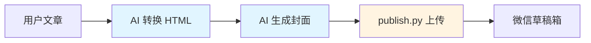

# 微信公众号文章管理 Skill

## 概述

这是一个专门用于管理微信公众号文章发布的 Skill。当您需要将文章发布到微信公众号时，此 Skill 会：

1. **AI 生成内容**：将文档转换为带内联样式的 HTML，并生成封面图
2. **脚本上传**：使用 Python 脚本上传素材和创建草稿

**核心原则：**
- **AI 负责**：文档转换、样式应用、封面生成
- **脚本负责**：微信 API 操作（上传素材、草稿管理）

## 快速开始

### 使用前准备

1. **配置微信公众号 API 凭证**

在项目根目录创建 `.env` 文件：

```bash
# 微信公众号配置（必需）
WECHAT_APP_ID=your_app_id_here
WECHAT_APP_SECRET=your_app_secret_here

# 输出配置（可选）
OUTPUT_DIR=./output
TEMP_DIR=./temp

# 样式配置（可选）
THEME_COLOR=#07c160
```

2. **安装依赖**

```bash
pip install -e .
```

### 基本使用

**场景 1: AI 直接发布（推荐）**

```
请将这篇文章发布到微信公众号草稿箱
```

AI 会自动：
1. 读取并分析文章内容
2. 生成带内联样式的 HTML
3. 生成封面图（1080×460）
4. 调用上传接口发布到微信草稿箱

**场景 2: 命令行发布（备选）**

```bash
# AI 生成内容后，使用命令行上传
python3 scripts/publish.py "文章标题" article.html cover.jpg
```

## 工作流程

### AI 发布流程



### 详细步骤

**第一步：AI 内容生成**

1. 读取文章内容（Markdown/文本）
2. 按样式规范转换为 HTML
3. 应用内联样式（标题、段落、代码块等）
4. 生成符合微信阅读体验的完整 HTML
5. 根据文章主题生成封面图（1080×460）

**第二步：微信 API 上传**

1. 接收 AI 生成的 HTML 和封面路径
2. 上传封面到微信素材库
3. 调用微信公众号 API 创建草稿
4. 返回草稿 media_id

### 为什么这样设计？

| 优势 | 说明 |
|------|------|
| **职责分离** | AI 擅长内容理解和样式应用，脚本专注 API 操作 |
| **质量更高** | AI 能理解语义，生成更符合公众号风格的内容 |
| **维护简单** | 脚本只做 API 调用，不需要维护复杂的文档解析逻辑 |
| **灵活扩展** | 可以轻松更换 AI 提供商或生成方式 |

## 样式规范

### 自动应用的样式

| 元素 | 样式特点 |
|------|----------|
| **一级标题** | 主题色渐变背景、白色文字、圆角阴影 |
| **二级标题** | 左侧主题色装饰条（4px）、12px 左内边距 |
| **段落** | 行高 1.75、字号 15px、两端对齐 |
| **代码块** | 深色背景（#2d2d2d）、支持横向滚动、字号 13px |
| **内联代码** | 浅灰背景（#f0f0f0）、粉色文字（#d63384） |
| **引用块** | 左侧主题色边框、浅灰背景 |
| **表格** | 表头主题色背景、白色文字、边框合并 |

### 主题色推荐

| 色值 | 适用场景 |
|------|----------|
| `#07c160` | 科技、效率（默认） |
| `#ff6b6b` | 生活、情感 |
| `#4a90e2` | 商业、职场 |
| `#f5a623` | 教育、培训 |
| `#9013fe` | 创意、设计 |

## 封面图生成

**自动封面规格：**
- 尺寸：1080×460 (2.35:1)
- 格式：JPEG
- 质量：95%
- 字体：华文黑体（支持中文）

**封面生成方式：**

| 方式 | 说明 | 适用场景 |
|------|------|----------|
| **搜索加工**（默认） | 从 Pexels 搜索高质量图片，添加渐变遮罩和标题文字 | 适用于所有文章 |
| **AI 生成** | 使用 Claude/Midjourney/DALL·E 生成 | 重要文章、品牌建设 |
| **模板生成** | 简单渐变背景 + 标题文字 | 快速生成 |

详细说明请查看 [封面生成参考](references/cover-guide.md)

## 移动端友好设计

### 代码块（移动端优化）

**关键特性：**
- 深色背景（#2d2d2d）保护眼睛
- 字号 13px 适合手机阅读
- **横向滚动**（overflow-x: auto）
- **不强制换行**（white-space: pre）
- **iOS 平滑滚动**（-webkit-overflow-scrolling: touch）

**设计原则：**
1. 不破坏代码结构
2. 支持横向滚动查看长代码
3. 触控滑动体验流畅

### 图片优化

**移动端建议：**
- 单张图片 ≤ 500KB
- 宽度 ≤ 900px
- 使用渐进式 JPEG
- 考虑图片懒加载

## CLI 命令

### 发布文章

```bash
# 使用 AI 生成的内容发布
python3 scripts/publish.py "文章标题" article.html cover.jpg
```

### 上传图片

```bash
# 上传单张图片（用于素材管理）
python3 scripts/cli.py upload-image cover.jpg

# 批量上传
python3 scripts/cli.py upload-images ./images
```

## 常见问题

### Q: 如何获取 media_id？

A: 发布成功后会返回 media_id，也可以在微信公众号后台查看

### Q: 图片上传失败怎么办？

A: 检查图片大小（thumb ≤ 2MB，image ≤ 5MB），使用 TinyPNG 压缩后重试

### Q: 代码块在手机上显示不全？

A: 这是正常的，代码块支持横向滚动，不会强制换行破坏代码结构

### Q: 如何只生成 HTML 不上传？

A: AI 可以直接输出 HTML 内容，保存为文件即可

## 项目结构

```
mp-weixin-skills/
├── SKILL.md              # 主文件
├── skills.json           # Skill 元数据
├── .env.example          # 环境配置示例
│
├── scripts/              # 可执行脚本
│   ├── publish.py        # 简化的发布接口（AI 调用）⭐
│   ├── cli.py           # 完整的命令行接口（可选）
│   ├── config.py        # 配置管理
│   ├── exceptions.py    # 自定义异常
│   │
│   ├── wechat/          # 微信 API 操作（核心）⭐
│   │   ├── __init__.py
│   │   └── api_client.py
│   │
│   └── utils/           # 工具函数
│       ├── __init__.py
│       └── logger.py
│
├── references/           # 详细文档（按需加载）📚
│   ├── cover-guide.md         # 封面指南
│   └── ...                   # 其他参考文档
│
├── output/              # 输出目录（生成）
└── temp/                # 临时文件（生成）
```

**核心功能说明：**
- ⭐ **wechat/** - 微信公众号 API 操作（上传素材、创建/更新草稿）
- ⭐ **publish.py** - 简化的发布接口，接收 AI 生成的 HTML 和封面
- 📚 **references/** - Progressive Disclosure 文档，按需加载

## 许可证

MIT License
