# 微信公众号文章管理 Skill 市场

[](https://opensource.org/licenses/MIT)
[](https://github.com/liangxp1990/mp-wechat-skills)
[](https://github.com/liangxp1990/mp-wechat-skills)

## 概述

这是一个专门用于管理微信公众号文章发布的 Claude Code Skill 市场。采用 **AI 驱动架构**：

1. **AI 负责**：文档转换、样式应用、封面生成
2. **脚本负责**：微信 API 操作、素材上传、草稿管理

## 安装

### 前置要求

| 要求 | 检查 | 安装 |
|------|------|------|
| Claude Code CLI | `claude --version` | [入门指南](https://claude.ai/code) |

### 快速安装

在终端（非 Claude Code 内部）运行：

```bash
# 1. 添加技能市场
claude plugin marketplace add liangxp1990/mp-wechat-skills

# 2. 安装技能
claude plugin install mp-weixin-skills@mp-weixin-skills
```

### 验证安装

```bash
# 检查市场是否已注册
claude plugin marketplace list

# 检查插件是否已安装
claude plugin list
```

## 使用

### 配置微信公众号 API 凭证

创建 `.env` 文件：

```bash
# 微信公众号配置（必需）
WECHAT_APP_ID=your_app_id_here
WECHAT_APP_SECRET=your_app_secret_here

# 输出配置（可选）
OUTPUT_DIR=./output
TEMP_DIR=./temp

# 样式配置（可选）
THEME_COLOR=#07c160
```

### 基本使用场景

**场景 1: AI 直接发布（推荐）**

```
请使用 mp-weixin-skills 将 article.md 发布到微信公众号草稿箱
```

AI 会自动：
1. 读取并转换文章为带样式的 HTML
2. 生成封面图（1080×460）
3. 上传到微信草稿箱

**场景 2: 上传图片素材**

```bash
# 上传单张图片
mp-weixin upload-image cover.jpg

# 批量上传
mp-weixin upload-images ./images
```

## 架构设计

```mermaid
graph LR
    A[用户文章] --> B[AI 转换 HTML]
    B --> C[AI 生成封面]
    C --> D[publish.py 上传]
    D --> E[微信草稿箱]

    style B fill:#e1f5ff
    style C fill:#e1f5ff
    style D fill:#fff4e1
```



### AI 职责

| 功能 | 说明 |
|------|------|
| **文档转换** | Markdown → HTML |
| **样式应用** | 添加内联样式（标题、段落、代码块等） |
| **封面生成** | 从 Pexels 搜索图片 + PIL 加工 |

### 脚本职责

| 功能 | 说明 |
|------|------|
| **微信 API** | 上传素材、创建/更新草稿 |
| **图片管理** | 批量上传图片到素材库 |

## 目录结构

```
mp-wechat-skills/
├── .claude-plugin/
│   ├── plugin.json          # 市场元数据
│   └── marketplace.json     # 插件注册表
├── .claude/skills/
│   └── mp-weixin-skills/    # 技能目录
│       ├── SKILL.md         # 技能定义
│       ├── skills.json      # 技能元数据
│       ├── scripts/         # Python 脚本
│       │   ├── publish.py   # 简化的上传接口
│       │   ├── cli.py       # 图片上传工具
│       │   └── wechat/      # 微信 API
│       └── references/      # 支持文档
│           └── cover-guide.md
├── scripts/                # 源脚本（同步到 skills）
├── references/             # 参考文档
└── README.md
```

## 更新市场

当有新版本发布时：

```bash
# 更新市场仓库
cd ~/.claude/plugins/marketplaces/mp-wechat-skills
git pull

# 重新安装更新的技能
claude plugin install mp-weixin-skills@mp-weixin-skills
```

## 版本历史

### v0.2.0 (2025-02-02)

**重大架构变更**

- ✨ **AI 驱动架构**：AI 直接生成 HTML 和封面
- 🗑️ **移除解析器**：parsers、converters、covers 模块
- ➕ **新增 publish.py**：简化的上传接口
- 📝 **更新文档**：SKILL.md、cover-guide.md

### v0.1.0

- 初始版本
- 支持 Markdown/Word/PDF 解析
- 支持自动封面生成

## 故障排除

### "Source path does not exist" 错误

**原因**：市场仓库不同步或有旧数据。

**修复**：
```bash
cd ~/.claude/plugins/marketplaces/mp-wechat-skills
git pull
claude plugin install mp-weixin-skills@mp-weixin-skills
```

### 技能未显示

**原因**：插件已安装但命令未被发现。

**修复**：
1. 验证插件是否安装：
   ```bash
   cat ~/.claude/plugins/installed_plugins.json | grep "mp-weixin-skills"
   ```
2. 重启 Claude Code
3. 清除缓存并重新安装：
   ```bash
   rm -rf ~/.claude/plugins/cache/mp-weixin-skills
   claude plugin install mp-weixin-skills@mp-weixin-skills
   ```

## 许可证

MIT License - 详见 [LICENSE](LICENSE) 文件

## 贡献

欢迎提交 Issue 和 Pull Request！

1. Fork 本仓库
2. 创建特性分支 (`git checkout -b feature/AmazingFeature`)
3. 提交更改 (`git commit -m 'Add some AmazingFeature'`)
4. 推送到分支 (`git push origin feature/AmazingFeature`)
5. 开启 Pull Request

## 作者

liangxp1990 - [GitHub](https://github.com/liangxp1990)

## 相关资源

- [Claude Code 官方文档](https://claude.ai/code)
- [微信公众号开发文档](https://developers.weixin.qq.com/doc/offiaccount/Getting_Started/Overview.html)
