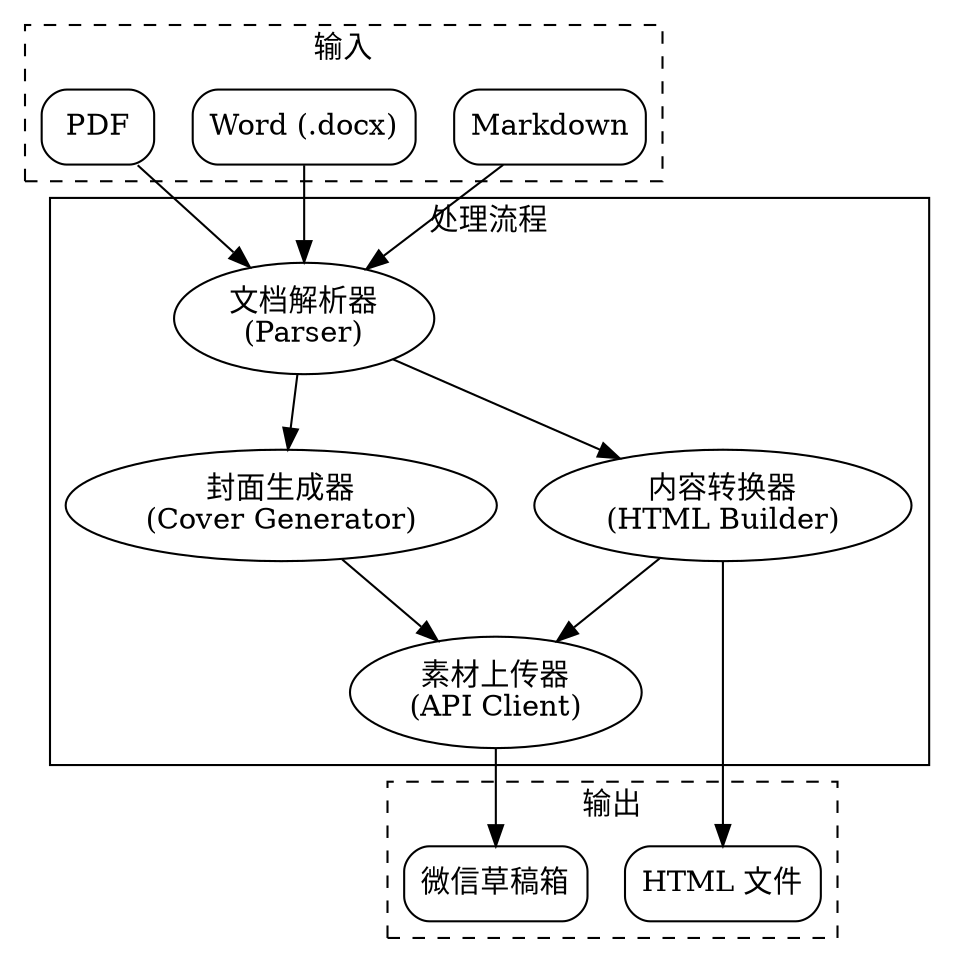

# 微信公众号文章发布工具

## Overview

一个强大的微信公众号文章发布工具，将 Markdown、Word 或 PDF 文档转换为符合微信公众号排版的 HTML 内容，支持自动生成封面、上传素材到微信素材库，并推送到草稿箱。

**Core principle:** 自动化处理内容发布流程，从文档转换到 API 上传一键完成。

## When to Use

**使用场景:**
- 需要定期发布文章到微信公众号
- 有大量 Markdown 文档需要转换为微信格式
- 希望自动化封面生成和素材上传流程
- 需要批量管理草稿箱中的文章

**使用前准备:**
1. 配置微信公众号 API 凭证（AppID 和 AppSecret）
2. 配置服务器 IP 白名单
3. 确保有稳定的网络连接

## Architecture



## Core Features

### 1. 文档解析器

**支持的格式:**
- ✅ Markdown (.md) - 已实现
- ⏸️ Word (.docx) - 未实现
- ⏸️ PDF (.pdf) - 未实现

**提取内容:**
- 标题（自动识别第一个一级标题）
- 正文内容
- 图片引用
- 代码块

### 2. 内容转换器

**转换特性:**
- 内联 CSS 样式（微信要求）
- 响应式布局
- 代码高亮
- 引用块美化
- 表格样式

**样式模板:**
| 模板 | 风格 | 适用场景 |
|------|------|----------|
| default | 简洁 | 通用内容 |
| modern | 现代 | 卡片风格，视觉层次分明 |
| classic | 经典 | 正式内容，传统媒体风 |
| tech | 技术 | 技术文章，代码友好 |
| minimal | 极简 | 强调内容本身 |

### 3. 封面生成器

**生成方式:**
- ✅ **本地模板**: 使用预设模板生成（始终可用）
- ⏸️ **AI 生成**: 使用 DALL-E 等 AI 服务
- ⏸️ **图库搜索**: 从 Unsplash/Pexels 搜索高质量图片

**封面规格:**
- 尺寸: 1080×460 (2.35:1)
- 格式: JPEG
- 质量: 95%
- 字体: 支持中文（华文黑体、宋体等）

**设计元素:**
- 渐变背景
- 主题色装饰条
- 几何图形装饰
- 文字阴影效果

### 4. API 集成

**功能:**
- 自动获取 access_token（带缓存）
- 上传封面图片到素材库
- 创建草稿到草稿箱
- 更新已有草稿
- 获取草稿详情

**API 端点:**
| 端点 | 功能 |
|------|------|
| `/cgi-bin/token` | 获取访问令牌 |
| `/cgi-bin/material/add_material` | 上传永久素材 |
| `/cgi-bin/draft/add` | 创建草稿 |
| `/cgi-bin/draft/update` | 更新草稿 |
| `/cgi-bin/draft/get` | 获取草稿详情 |

## Command Reference

### publish - 发布文章

```bash
mp-weixin publish <file> [options]
```

**参数:**
- `file` - 源文件路径（必需）

**选项:**
| 选项 | 说明 |
|------|------|
| `--cover-type` | 封面生成方式 (template/ai/search) |
| `--template` | 样式模板 (default/modern/classic/tech/minimal) |
| `--theme-color` | 主题颜色 (如 #07c160) |
| `--no-api` | 不使用 API，仅生成 HTML 文件 |
| `--verbose, -v` | 详细输出 |
| `--env` | 环境文件路径 |

**示例:**

```bash
# 基本发布
mp-weixin publish article.md

# 使用指定模板
mp-weixin publish article.md --template modern

# 仅转换格式（不上传）
mp-weixin publish article.md --no-api
```

### update - 更新草稿

```bash
mp-weixin update <media_id> [options]
```

**参数:**
- `media_id` - 草稿的 Media ID（必需）

**选项:**
| 选项 | 说明 |
|------|------|
| `--source` | 指定新的源文件 |
| `--regenerate-cover` | 重新生成封面 |

**示例:**

```bash
# 更新草稿（保持原封面）
mp-weixin update s_UokPQPIM8nkGd3QjvYHFFQq8HUuilOgU2rtin6ZBFfkK10hwHDHqhFr1jhzcIf

# 更新并重新生成封面
mp-weixin update <media_id> --regenerate-cover

# 使用新源文件更新
mp-weixin update <media_id> --source new-article.md
```

### version - 显示版本

```bash
mp-weixin version
```

## Configuration

### 环境变量 (.env)

```bash
# 微信公众号配置（必需）
WECHAT_APP_ID=your_app_id
WECHAT_APP_SECRET=your_app_secret

# 封面生成配置（可选）
COVER_GENERATOR=auto
OPENAI_API_KEY=your_openai_key
UNSPLASH_API_KEY=your_unsplash_key

# 输出配置
OUTPUT_DIR=./output
TEMPLATE_NAME=default
THEME_COLOR=#07c160

# 日志配置
LOG_LEVEL=INFO
LOG_FILE=mp_weixin.log
```

### IP 白名单配置

在微信公众号后台配置服务器 IP 白名单：

1. 登录微信公众平台
2. 进入「开发 → 基本配置」
3. 找到「IP 白名单」
4. 添加服务器公网 IP
5. 等待 5-15 分钟生效

## Error Handling

### 常见错误码

| 错误码 | 说明 | 解决方案 |
|--------|------|----------|
| 40001 | AppSecret 错误 | 检查 AppSecret 是否正确 |
| 40002 | 不合法的凭证类型 | 检查 grant_type 参数 |
| 40164 | IP 不在白名单 | 配置 IP 白名单，等待生效 |
| 40007 | 无效的 media_id | 检查 media_id 是否正确 |
| 45009 | 接口调用超过限制 | 等待限制重置 |

### 中文乱码问题

**症状:** 文章内容显示为 `\u793a\u4f8b\u6587\u7ae0`

**原因:** JSON 序列化时默认转义中文字符

**状态:** ✅ 已修复 - 使用 `ensure_ascii=False`

### 更新草稿创建新草稿

**症状:** 更新草稿时创建了新的草稿

**原因:** API 请求格式错误（`articles` 应为对象而非数组）

**状态:** ✅ 已修复

## Project Status

**版本:** 0.1.0
**仓库:** https://github.com/liangxp1990/mp-wechat-skills
**测试:** 26/26 通过

**已实现功能:**
- ✅ Markdown 文档解析
- ✅ 微信公众号格式 HTML 转换
- ✅ 本地模板封面生成（1080×460，支持中文）
- ✅ 微信公众号 API 集成（素材上传、草稿创建/更新）
- ✅ CLI 命令行工具
- ✅ 手动模式和 API 模式
- ✅ 草稿更新功能

**未实现功能:**
- ⏸️ Word (.docx) 解析器
- ⏸️ PDF 解析器
- ⏸️ AI 封面生成器
- ⏸️ 图库搜索封面生成器

## Technical Stack

- **Python:** 3.10+
- **文档解析:** markdown-it-py
- **图片处理:** Pillow (PIL)
- **HTTP 请求:** requests（带重试机制）
- **配置管理:** python-dotenv
- **CLI 框架:** Click

## Development

### 安装

```bash
# 克隆仓库
git clone https://github.com/liangxp1990/mp-wechat-skills.git
cd mp-wechat-skills

# 安装依赖
pip install -e .

# 配置环境变量
cp .env.example .env
# 编辑 .env 填入你的配置
```

### 运行测试

```bash
pytest tests/
```

### 设计文档

- [设计文档](docs/plans/2025-01-29-wechat-publisher-design.md)
- [实现计划](docs/plans/2025-01-29-implementation-plan.md)

## Usage as Claude Code Skill

### 安装 Skill

```bash
# 复制到 Claude Code skills 目录
cp -r /path/to/mp-weixin-skills ~/.claude/skills/mp-weixin-skills
```

### 使用示例

```
你: 使用 mp-weixin-skills 将 my-article.md 发布到微信公众号

Claude: 好的，我来帮你发布文章...

[解析文档...]
[生成封面...]
[上传素材...]
[创建草稿...]

✅ 文章发布成功!
   Media ID: s_UokPQPIM8nkGd3QjvYHFFQq8HUuilOgU2rtin6ZBFfkK10hwHDHqhFr1jhzcIf
   📝 请在微信公众号后台查看草稿
```

## License

MIT License
