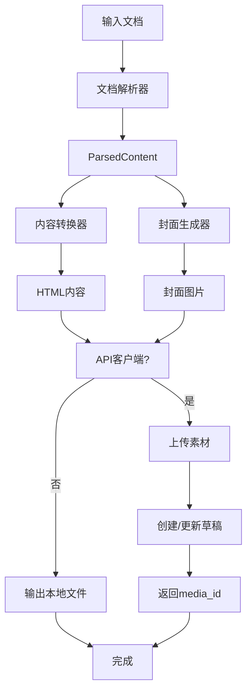

# 微信公众号文章发布工具 - 设计文档

**项目名称**: mp-weixin-skills
**创建日期**: 2025-01-29
**版本**: 1.0
**作者**: Claude AI

---

## 1. 项目概述

### 1.1 目标

开发一个将 Word、PDF 或 Markdown 文件转换为符合微信公众号排版要求的 HTML 内容的工具，支持：

1. 根据主题内容生成或获取封面图
2. 上传封面图到微信公众号素材库
3. 将文档转换为微信公众号文章格式
4. 处理多媒体内容（图片上传）
5. 优化排版布局，提供样式模板
6. 通过 API 推送到草稿箱或更新现有草稿

### 1.2 目标用户

- **主要用户**: 个人内容创作者
- **使用场景**: 快速将本地文档发布到微信公众号

### 1.3 技术选型

- **语言**: Python 3.10+
- **架构**: 全集成 CLI 工具（方案一）
- **依赖库**:
  - `python-docx` - Word 文档解析
  - `PyMuPDF` - PDF 文档解析
  - `markdown-it-py` - Markdown 解析
  - `requests` - HTTP 请求
  - `Pillow` - 图片处理
  - `python-dotenv` - 环境变量管理

---

## 2. 架构设计

### 2.1 整体架构图

```
┌─────────────────────────────────────────────────────────┐
│                     CLI 入口 (cli.py)                    │
├─────────────────────────────────────────────────────────┤
│  ┌─────────────┐  ┌──────────────┐  ┌────────────────┐  │
│  │ 文档解析器   │  │ 内容转换器    │  │  封面生成器    │  │
│  │             │→ │              │→ │                │  │
│  │ MD/PDF/DOC  │  │ HTML+CSS     │  │ AI/搜索/模板   │  │
│  └─────────────┘  └──────────────┘  └────────────────┘  │
│         ↓                  ↓                ↓           │
│  ┌─────────────┐  ┌──────────────┐  ┌────────────────┐  │
│  │ 图片处理器   │  │ 样式应用器    │  │  素材上传器    │  │
│  └─────────────┘  └──────────────┘  └────────────────┘  │
│                                            ↓             │
│                                  ┌─────────────────┐    │
│                                  │ 微信公众号API    │    │
│                                  │ - 上传素材       │    │
│                                  │ - 创建草稿       │    │
│                                  │ - 更新草稿       │    │
│                                  └─────────────────┘    │
└─────────────────────────────────────────────────────────┘
```

### 2.2 项目目录结构

```
mp-weixin-skills/
├── SKILL.md                 # Skill 定义文件
├── pyproject.toml           # 项目配置
├── README.md                # 使用文档
├── .env.example             # 环境变量模板
├── src/
│   ├── __init__.py
│   ├── cli.py               # CLI 入口
│   ├── config.py            # 配置管理
│   ├── exceptions.py        # 异常定义
│   ├── error_handler.py     # 错误处理
│   ├── parsers/             # 文档解析器
│   │   ├── __init__.py
│   │   ├── base.py          # 基类和工厂
│   │   ├── markdown.py      # Markdown 解析
│   │   ├── word.py          # Word 解析
│   │   └── pdf.py           # PDF 解析
│   ├── converters/          # 内容转换器
│   │   ├── __init__.py
│   │   ├── html_builder.py  # HTML 构建
│   │   ├── style_manager.py # 样式管理
│   │   └── templates/       # 样式模板
│   │       ├── default.html
│   │       ├── modern.html
│   │       ├── classic.html
│   │       ├── tech.html
│   │       └── minimal.html
│   ├── covers/              # 封面生成器
│   │   ├── __init__.py
│   │   ├── base.py          # 基类
│   │   ├── ai_generator.py  # AI 生成
│   │   ├── image_search.py  # 图库搜索
│   │   └── template_maker.py # 本地模板
│   ├── media/               # 媒体处理
│   │   ├── __init__.py
│   │   ├── processor.py     # 图片处理
│   │   └── uploader.py      # 素材上传
│   ├── wechat/              # 微信公众号 API
│   │   ├── __init__.py
│   │   ├── api_client.py    # API 客户端
│   │   ├── auth.py          # 认证管理
│   │   └── draft_manager.py # 草稿管理
│   └── utils/               # 工具函数
│       ├── __init__.py
│       └── logger.py        # 日志管理
├── examples/                # 示例文件
├── scripts/                 # 辅助脚本
├── templates/               # 输出模板
└── docs/                    # 文档
    └── plans/               # 设计文档
```

---

## 3. 核心模块设计

### 3.1 文档解析模块

#### 统一解析接口

```python
@dataclass
class ParsedContent:
    """解析后的内容结构"""
    title: str                      # 文章标题
    content: str                    # 正文内容（HTML格式）
    images: List[Path]              # 文内图片路径列表
    metadata: dict                  # 元数据（作者、日期等）
    toc: Optional[List[dict]]       # 目录结构

class BaseParser(ABC):
    """解析器基类"""
    @abstractmethod
    def parse(self, file_path: Path) -> ParsedContent: pass

    @abstractmethod
    def supports(self, file_path: Path) -> bool: pass
```

#### 解析器实现

| 解析器 | 库 | 支持格式 | 功能 |
|--------|-----|----------|------|
| MarkdownParser | markdown-it-py | .md | GFM、元数据、图片提取 |
| WordParser | python-docx | .docx | 标题、正文、图片、格式 |
| PDFParser | PyMuPDF | .pdf | 文本、图片、多列布局 |

### 3.2 内容转换模块

#### HTML 构建器

```python
class WechatHTMLBuilder:
    """微信公众号 HTML 构建器"""
    def build(self, parsed: ParsedContent) -> str:
        # 1. 应用模板样式
        # 2. 转换内容元素
        # 3. 处理图片标签
        # 4. 生成最终 HTML
        pass
```

#### 样式模板

提供 5 种预设模板：

| 模板 | 风格 | 特点 |
|------|------|------|
| default | 简洁 | 默认风格，适合大多数内容 |
| modern | 现代 | 卡片风格，视觉层次分明 |
| classic | 经典 | 传统媒体风格，正式感 |
| tech | 技术 | 代码友好，适合技术文章 |
| minimal | 极简 | 最小化设计，突出内容 |

### 3.3 封面生成模块

#### 统一接口

```python
@dataclass
class CoverResult:
    """封面生成结果"""
    image_path: Path           # 生成的图片路径
    source_type: str           # 来源类型 (ai/template/search)
    metadata: dict             # 元数据
    needs_upload: bool = True  # 是否需要上传到微信

class BaseCoverGenerator(ABC):
    @abstractmethod
    def generate(self, title: str, content: str, **kwargs) -> CoverResult: pass
```

#### 生成器实现

| 生成器 | 依赖 | 特点 |
|--------|------|------|
| AICoverGenerator | OpenAI/Midjourney API | AI 创意生成 |
| ImageSearchCoverGenerator | Unsplash/Pexels API | 高质量图库 |
| TemplateCoverGenerator | Pillow/PIL | 本地模板，始终可用 |

#### 封面规格

- 尺寸比例：2.35:1
- 推荐尺寸：900×383 或 1080×460
- 格式：JPG/PNG
- 大小限制：< 5MB（缩略图 < 64KB）

### 3.4 微信公众号 API 集成

#### API 端点

| 功能 | 端点 | 说明 |
|------|------|------|
| 获取 token | /cgi-bin/token | 获取 access_token |
| 上传素材 | /cgi-bin/material/add_material | 上传永久素材 |
| 创建草稿 | /cgi-bin/draft/add | 创建草稿 |
| 更新草稿 | /cgi-bin/draft/update | 更新已有草稿 |

#### API 客户端

```python
class WechatApiClient:
    """微信公众号 API 客户端"""

    def get_access_token(self) -> str:
        """获取访问令牌"""

    def upload_media(self, file_path: str, media_type: str = "thumb") -> Dict:
        """上传永久素材"""

    def upload_draft(self, articles: List[Dict]) -> Dict:
        """上传草稿"""

    def update_draft(self, media_id: str, index: int, article: Dict) -> Dict:
        """更新草稿"""
```

#### 草稿管理

```python
@dataclass
class DraftMetadata:
    """草稿元数据"""
    media_id: str
    title: str
    created_at: str
    updated_at: str
    file_path: Path
    cover_media_id: str = ""
    content_media_ids: List[str] = None

class DraftManager:
    """草稿管理器 - 跟踪和管理已发布的草稿"""
```

---

## 4. 日志系统

### 4.1 设计原则

1. **清晰标识**: 每条日志带模块标签 `[ModuleName]`
2. **彩色输出**: 控制台使用 ANSI 颜色区分级别
3. **结构化存储**: 文件日志使用 JSON 格式
4. **分级记录**: 开发时 DEBUG，生产时 INFO

### 4.2 日志级别使用

| 级别 | 使用场景 | 示例 |
|------|----------|------|
| DEBUG | 详细调试信息 | 变量值、调用堆栈 |
| INFO | 关键步骤 | 模块开始/完成、API 调用 |
| WARNING | 警告信息 | 使用默认值、响应缓慢 |
| ERROR | 错误信息 | 操作失败、异常 |
| CRITICAL | 严重错误 | 程序无法继续 |

### 4.3 输出示例

```
2025-01-29 10:00:00 | INFO     | [CLI]       | 微信公众号文章发布工具启动
2025-01-29 10:00:01 | INFO     | [Parser]    | 开始解析文件: article.md
2025-01-29 10:00:04 | INFO     | [WechatAPI] | 素材上传成功 - media_id: xxxxx
2025-01-29 10:00:07 | INFO     | [CLI]       | ✅ 文章发布成功！
```

---

## 5. 错误处理

### 5.1 异常层次结构

```
MpWeixinError (基类)
├── ParserError (解析错误)
│   ├── UnsupportedFileTypeError
│   └── FileReadError
├── CoverError (封面错误)
│   ├── NoCoverGeneratorAvailableError
│   └── AIGenerationError
├── WechatApiError (API 错误)
│   ├── ApiConfigError
│   └── [具体错误码处理]
├── ConversionError (转换错误)
│   ├── TemplateNotFoundError
│   └── ContentTooLongError
└── NetworkError (网络错误)
```

### 5.2 用户友好提示

每个异常都提供：
- 清晰的错误描述
- 具体的原因分析
- 可操作的解决方案

```python
# 示例：ApiConfigError 的用户消息
❌ 微信公众号 API 配置不完整

缺少配置: WECHAT_APP_SECRET

请检查 .env 文件，确保以下配置已填写：
- WECHAT_APP_ID
- WECHAT_APP_SECRET

💡 如果不使用 API，可以运行手动模式：
   mp-weixin publish article.md --no-api
```

---

## 6. CLI 命令设计

### 6.1 主要命令

```bash
# 发布文章
mp-weixin publish <file> [options]

# 更新已有草稿
mp-weixin update <media_id> [options]

# 列出已发布的草稿
mp-weixin list

# 仅转换格式（不上传）
mp-weixin convert <file> [options]
```

### 6.2 常用选项

```bash
# 封面生成方式
--cover-type auto|ai|search|template

# 样式模板
--template default|modern|classic|tech|minimal

# 主题颜色
--theme-color #07c160

# 是否使用 API
--api/--no-api

# 详细输出
--verbose/-v

# 环境文件
--env .env
```

### 6.3 使用示例

```bash
# 基本使用
mp-weixin publish article.md

# 使用 AI 生成封面
mp-weixin publish article.md --cover-type ai

# 更新已有草稿
mp-weixin update <media_id>

# 仅转换不上传
mp-weixin convert article.md --no-api
```

---

## 7. 环境配置

### 7.1 .env 配置文件

```bash
# 微信公众号配置（必需，使用 API 时）
WECHAT_APP_ID=your_app_id
WECHAT_APP_SECRET=your_app_secret

# 封面生成配置（可选）
COVER_GENERATOR=auto
OPENAI_API_KEY=your_openai_key
UNSPLASH_API_KEY=your_unsplash_key

# 输出配置
OUTPUT_DIR=./output
TEMP_DIR=./temp

# 样式配置
TEMPLATE_NAME=default
THEME_COLOR=#07c160

# 日志配置
LOG_LEVEL=INFO
LOG_FILE=./output/mp-weixin.log
```

### 7.2 手动模式

如果不配置 API 凭证，工具将运行在手动模式：

1. 生成 HTML 内容
2. 生成封面图
3. 生成素材清单
4. 输出操作指引

---

## 8. 数据流图



---

## 9. 实现计划

### 阶段一：基础功能
1. 项目初始化和依赖安装
2. 文档解析模块（MD/PDF/Word）
3. 内容转换模块
4. 基础 CLI 框架

### 阶段二：样式和封面
1. 样式模板系统
2. 本地模板封面生成
3. 图库搜索封面生成

### 阶段三：API 集成
1. 微信公众号 API 客户端
2. 素材上传功能
3. 草稿创建功能

### 阶段四：增强功能
1. 草稿更新功能
2. AI 封面生成
3. 草稿管理器
4. 错误处理优化

### 阶段五：测试和文档
1. 单元测试
2. 集成测试
3. 用户文档
4. Skill 定义

---

## 10. 风险和缓解

| 风险 | 影响 | 缓解措施 |
|------|------|----------|
| API 变更 | 功能失效 | 版本检查、兼容性提示 |
| 图片上传失败 | 内容不完整 | 手动模式兜底 |
| 封面生成失败 | 无封面 | 多种生成方式、本地模板 |
| 内容超长 | 发布失败 | 预检查、提示用户 |

---

## 附录

### A. 微信公众号 API 参考

- [新增永久素材](https://developers.weixin.qq.com/doc/subscription/api/material/permanent/api_addmaterial.html)
- [新增草稿](https://developers.weixin.qq.com/doc/subscription/api/draftbox/draftmanage/api_draft_add.html)
- [更新草稿](https://developers.weixin.qq.com/doc/subscription/api/draftbox/draftmanage/api_draft_update.html)

### B. 依赖库版本

```
python-docx>=1.0.0
PyMuPDF>=1.23.0
markdown-it-py>=3.0.0
requests>=2.31.0
Pillow>=10.0.0
python-dotenv>=1.0.0
```

### C. 开发规范

1. 代码风格：遵循 PEP 8
2. 类型注解：使用 Python 3.10+ 类型注解
3. 文档字符串：使用 Google 风格
4. 测试覆盖：目标覆盖率 > 80%
